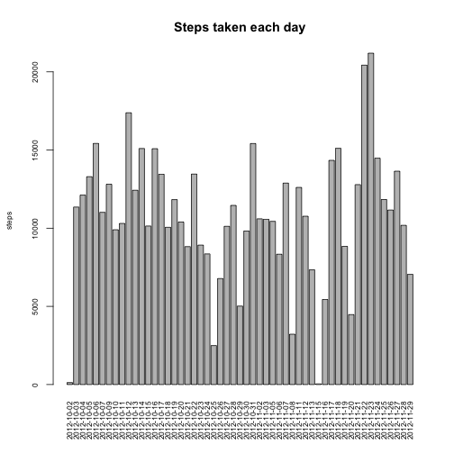
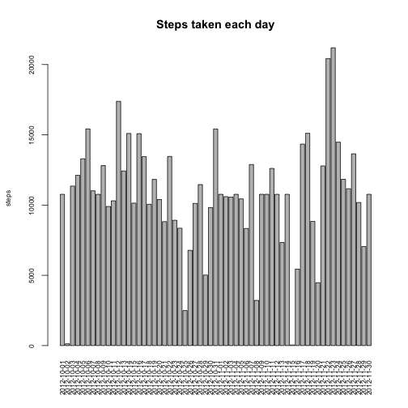

Reproducible Research - Peer Assessment 1
========================================================

Downloading and loading data into R.


```r
url = "https://d396qusza40orc.cloudfront.net/repdata%2Fdata%2Factivity.zip"
download.file(url, destfile = "activity.zip", method = "curl")
unzip("activity.zip", exdir = ".")
activity = read.csv("activity.csv")
```


Adjusting data.


```r
activity$date = as.Date(activity$date)
activity$steps = as.numeric(activity$steps)
```


Creating a histogram for total number of steps taken each day.


```r
a = aggregate(steps ~ date, data = activity, FUN = sum)
barplot(a$steps, names.arg = a$date, main = "Steps taken each day", xlab = "", ylab = "steps", cex.axis = 0.7, cex.lab = 0.7, cex.names = 0.7, las = 3)
```

 


Calculate mean and median for steps taken each day.


```r
mean(a$steps)
```

```
## [1] 10766
```

```r
median(a$steps)
```

```
## [1] 10765
```


Plotting average number of steps taken each day against 5-minute intervals.


```r
plot(aggregate(steps ~ interval, data = activity, FUN = mean), type = "l", main = "Average number of steps per interval", cex.axis = 0.8, cex.lab = 0.8, ylab = "average number of steps")
```

 


Calculating the 5-minute interval with highest average number of steps across all days.


```r
b = which.max(aggregate(steps ~ interval, data = activity, FUN = mean)$steps)
aggregate(steps ~ interval, data = activity, FUN = mean)$interval[b]
```

```
## [1] 835
```


Calculating number of missing values (NA).


```r
sum(is.na(activity$steps))
```

```
## [1] 2304
```


Filling the missing values and creating a dataset.


```r
library(Hmisc)
```

```
## Loading required package: grid
## Loading required package: lattice
## Loading required package: survival
## Loading required package: splines
## Loading required package: Formula
## 
## Attaching package: 'Hmisc'
## 
## Die folgenden Objekte sind maskiert from 'package:base':
## 
##     format.pval, round.POSIXt, trunc.POSIXt, units
```

```r
newdata = activity
newdata$steps = with(newdata, impute(steps, mean))
```


Creating new histogram with the filled dataset.


```r
d = aggregate(steps ~ date, data = newdata, FUN = sum)
barplot(d$steps, names.arg = d$date, main = "Steps taken each day", xlab = "", ylab = "steps", cex.axis = 0.7, cex.lab = 0.7, cex.names = 0.7, las = 3)
```

 


Calculating mean and median for new dataset.


```r
mean(d$steps)
```

```
## [1] 10766
```

```r
median(d$steps)
```

```
## [1] 10766
```

Compared with before the median changed but the mean stayed the same. This is due to the effect that imputation does not affect the mean since it replaces all NAs with the mean value. The median changed because the number of values increased by replacing NAs with the mean value so the exact number in the middle became different (50% value of number order).
The histogram now shows more values as days with NAs were filled with mean value.


Creating a new factor variable.
(Many apologies for the german words for the weekdays but I have not yet found out how to adjust this in R. [Montag = Monday, Dienstag = Tuesday, Mittwoch = Wednesday, Donnerstag = Thursday, Freitag = Friday, Samstag = Saturday, Sonntag = Sunday])


```r
newdata$weekday = weekdays(newdata$date)
newdata$weekday = gsub("Montag", "weekday", newdata$weekday)
newdata$weekday = gsub("Dienstag", "weekday", newdata$weekday)
newdata$weekday = gsub("Mittwoch", "weekday", newdata$weekday)
newdata$weekday = gsub("Donnerstag", "weekday", newdata$weekday)
newdata$weekday = gsub("Freitag", "weekday", newdata$weekday)
newdata$weekday = gsub("Samstag", "weekend", newdata$weekday)
newdata$weekday = gsub("Sonntag", "weekend", newdata$weekday)
newdata$weekday = as.factor(newdata$weekday)
```


Creating a panel plot with 5-minute interval on the x-axis and the number of steps on the y-axis devided by the factors "weekend" and "weekday".


```r
e = aggregate(steps ~ interval + weekday, data = newdata, FUN = mean)
library(lattice)
xyplot(e$steps ~ e$interval|e$weekday, type = "l", layout = c(1,2), ylab = "Number of steps", xlab = "Interval")
```

 
